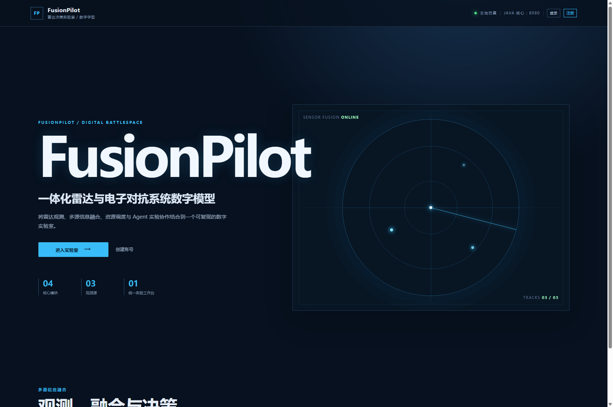
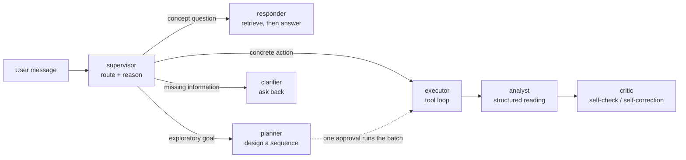

# FusionPilot · Radar & ECM Simulation Lab with an LLM Agent

> A digital lab where a **radar multi-source fusion / resource-scheduling simulation core** and an **LLM agent that designs and runs its own experiments** live side by side.

Java owns the simulation and the domain truth, Python owns the agent orchestration, Vue owns the visualisation. The boundaries are strict: every claim the agent makes has to trace back to structured results the Java core returned.

[](LICENSE)
[](#tests)
[](#tests)
[](#tests)



*This is the translated summary. The full documentation is in Chinese: [readme.md](readme.md).*

---

## What it is

A radar simulation platform normally lets you "change a parameter, run once, read a number". Real research
is multi-step — compare two fusion methods, see what raising the resource count from 2 to 4 does, decide
whether a difference is a method difference or one seed's noise. FusionPilot hands that loop to an agent:
it plans a multi-step experiment sequence, runs it once the user approves, reads the metrics, and — the
hard part — **knows what it is not allowed to say**.

The difficulty here is not wiring up a large language model. It is *constraint*. A model left alone will
invent metric values, call deterministic reproduction "the result was cached", and describe the platform as
more capable than it is. Most of the engineering effort in this repo is spent on those constraints.

---

## Simulation core (Java / Spring Boot)

- **Five fusion methods** — confidence-weighted average, simple average, nearest neighbour, distance-gated,
  and a constant-velocity Kalman filter. Each one's semantics, reported fields and best-fit use are
  documented in code and in the agent's knowledge base.
- **Two scheduling policies** — round-robin and priority, with a same-configuration comparison that returns
  both sides' metrics plus the delta.
- **Five aggregate metrics** — mean position error, tracking rate, resource utilisation, mean waiting time,
  scheduling switches — plus per-step metrics for time-series plots.
- **Reproducible** — same configuration and seed reproduce bit-identical metrics. Every run gets its own run
  id and configuration digest, and can be reopened and exported from the workbench.
- **Asynchronous execution** — bounded executor with progress reporting and cancellation.

## Agent (Python / FastAPI + LangGraph)

A **supervisor over specialists**, not one model doing five jobs:



The roles differ in **power, not in wording**. Only the executor has a tool channel; the responder and the
analyst call `complete`, which has no `tools` parameter to pass, so those two roles structurally cannot act
on the simulation.

Capabilities:

- **Grounded concept answers** — the platform's own domain corpus is retrieved before answering, and the
  sections used are listed under the reply. Anything the corpus cannot answer is refused instead of filled
  in from general knowledge.
- **Confirmation gate** — tools that spend resources require explicit approval, and one approval can cover an
  entire multi-step plan.
- **Structured reading** — after a run, the analyst role produces a summary plus evidence rows and
  limitations. Evidence rows may only quote metrics this run actually returned; a metric name the model
  invents is filtered out mechanically.
- **Two-layer self-check** — deterministic checks in plain code (impossible metric ranges, evidence drifting
  from the metrics) plus a model audit of the agent's own prose against the evidence, with a tagged
  correction appended when the prose outruns what the tools returned.
- **Long-term memory** — user preferences and stable findings distilled into one persistent note.
- **BYOK** — bring your own model token (OpenAI / Claude / DeepSeek / Qwen / Zhipu). The key travels in the
  `X-Model-Api-Key` request header and is never persisted, snapshotted or logged.
- **Token-level streaming** over SSE, with live stage and tool progress.
- **Multi-turn conversations** persisted per turn, with an invariant that the transcript is always replayable.

## Engineering (as important as the features)

- **Evaluation suite** (`agent-service/evals/`, 17 cases) — cases carry their own scripted model, so it runs
  in **0.4 seconds with no API key, no MySQL and no Java process**. It measures agent behaviour *given* a
  model decision: routing, the confirmation gate, tool ordering, grounding and citation, the self-check
  layer, per-role call counts, and cost gates. The grader is a pure function and every assertion in its
  vocabulary has a negative test.
- **Offline determinism is enforced, not claimed** — `httpx.AsyncClient.send` is replaced with a raise for
  the duration of a case, so any unpatched outbound path fails loudly instead of quietly reaching a provider.
- **No LLM judge** — the hallucination check is mechanical: decimals and percentages in the reply must trace
  to the run's metrics (≈0.5% relative tolerance), and no metric name may appear that the run did not return.
  Known limitations are documented rather than papered over.
- **A real-browser debugging harness** — zero-dependency headless Chrome scripts that reproduce
  "the page looks completely dead" style problems and capture console and network errors.

---

## Quick start

Prerequisites: JDK 17+, Node.js 18+, Python 3.11+, MySQL 8.0 (optional — without it the backend starts on
in-memory H2 and loses data on restart).

```bash
git clone https://github.com/poyuntunhai/FusionPilot.git FusionPilot && cd FusionPilot

# 1. simulation core (zero config on H2)
cd backend && ./mvnw spring-boot:run          # Windows: .\mvnw.cmd spring-boot:run

# 2. agent service
cd agent-service && python -m venv .venv && .venv/Scripts/activate
pip install -r requirements.txt
python -m uvicorn app.main:app --reload --port 8000

# 3. frontend
cd web && npm install && npm run dev
```

Open **http://127.0.0.1:5173/** and register an account (login asks a small arithmetic captcha).

> **The agent works without a model token.** It then runs in rule mode: the full change-config → run →
> read-metrics flow still works, but replies are produced by the local rule planner (`produced_by: rule`).
> To see the AI behaviour, pick a provider in the model bar and paste your own token.

## Tests

```bash
cd agent-service && python -m pytest tests      # 208 agent tests
cd agent-service && python -m evals.run_evals   # 17 eval cases, 0.4s, offline
cd backend && ./mvnw test                       # 39 Java tests
cd web && npx vue-tsc -b                        # frontend type check (must use -b)
```

## Known limitations

Part of this project's value is being explicit about what it is not: constant-velocity targets only (no
manoeuvre, no clutter, no false alarms, no target birth/death); the fusion layer receives the ground-truth
target state, so only `KALMAN_FILTER` reports an estimated velocity; one seed is one sample, so a method
ranking cannot be derived from a single run; the Kalman process noise is an assumption, not a calibrated
value. These are written into the agent's knowledge base, so when someone asks what the platform can do the
agent says this too, instead of overselling the project.

## Documentation

| Document | Contents |
|---|---|
| `docs/architecture/knowledge-retrieval.md` | Knowledge retrieval design, **why there is no vector database**, and when that decision should be revisited |
| `agent-service/evals/README.md` | Evaluation suite: case format, assertion vocabulary, stated boundary |
| `docs/deployment-plan.md` | Deployment: architecture, host selection, staged steps, hardening checklist, cost |
| `docs/mysql/schema-design.md` | MySQL schema and migration strategy |

## License

[MIT](LICENSE) © 2026 poyuntunhai
