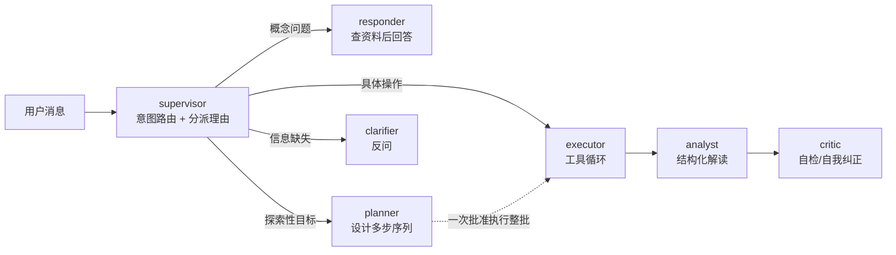
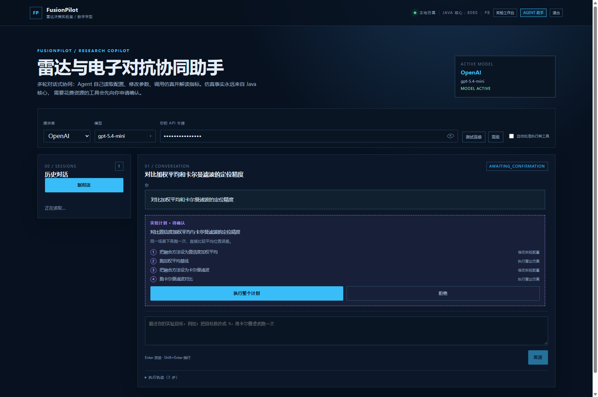

# FusionPilot · 一体化雷达与电子对抗仿真平台

> 一个把**雷达多源融合 / 资源调度仿真核心**和**能自己设计并执行实验的 LLM Agent**放在一起跑的数字实验室。

**English summary: [README.en.md](README.en.md)**

Java 负责仿真与领域真相，Python 负责 Agent 编排，Vue 负责可视化。三者边界严格，Agent 的每一句结论都必须能追溯到 Java 返回的结构化结果。

[](LICENSE)
[](#测试与评测)
[](#测试与评测)
[](#测试与评测)


---

## 它解决什么问题

雷达仿真平台通常只能"改参数—跑一次—读数字"，而真正的研究流程是**多步的**：对比两种融合方法、看某个资源数从 2 加到 4 的影响、判断一次差异是方法差异还是随机种子波动。FusionPilot 把这条链路交给一个 Agent：它自己规划多步实验序列、在用户批准后连续执行、读懂指标，并且**知道自己不能说什么**。

这里的难点不在"接一个大模型"，而在于**约束**：LLM 很容易编造数值、把确定性复现说成"结果被缓存"、把平台说成比实际更完备。这个项目花了大量精力在这些约束上（见下方"工程化"一节）。

---

## 核心能力

### 1. 仿真核心（Java / Spring Boot）

- **五种融合方法**：置信度加权平均、简单平均、最近邻、距离门限、卡尔曼滤波。每种方法的语义、上报字段与适用场景都在代码注释和 Agent 的知识库里有明确定义。
- **两种调度策略**：轮询、优先级，支持同一配置下的策略对比（返回双侧指标 + 差值）。
- **五个聚合指标**：平均位置误差、跟踪率、资源利用率、平均等待时间、调度切换次数，外加逐步指标用于画时间序列。
- **可复现**：同一配置 + 同一种子 → 逐位相同的指标。运行记录带独立 run id 与配置摘要，可在工作台重新打开、导出。
- **异步运行**：带进度上报与取消（`SimulationJobService`），前端不猜进度。

### 2. Agent（Python / FastAPI + LangGraph）

一个**主管 + 专员**结构，而不是一个模型兼五职：



角色之间**差的是权限，不是措辞**：只有 executor 有工具通道；responder 与 analyst 走 `complete`，而它没有 tools 参数可传，所以这两个角色在结构上就无法动仿真。

具体能力：

- **有出处的概念回答**：回答前检索平台自己的领域知识库，回答下方列出引用了哪几节；知识库没有的内容会明确拒答，不用通用常识硬填。
- **确认门**：会花资源的调用（跑仿真、策略对比）默认必须用户批准；一次确认可以批准**整个多步计划**。
- **结构化解读**：运行结束后由 analyst 角色产出「摘要 + 证据行 + 局限」，证据行只允许引用本次运行真实返回的指标——模型编造的指标名会被机械过滤掉。
- **自检与自我纠正**：两层。一层是纯代码的确定性检查（指标超出物理范围、证据与指标不一致）；一层是模型审校自己的措辞是否超出证据，越界时追加一条纠正并标注 `reflect:`。
- **长期记忆**：把用户偏好与稳定结论蒸馏成一条持久笔记，跨会话延续。
- **BYOK**：用户自带模型令牌（OpenAI / Claude / DeepSeek / Qwen / 智谱），密钥走 `X-Model-Api-Key` 请求头，**不入库、不落会话快照、不进日志**。
- **流式输出**：token 级 SSE，阶段提示与工具进度实时可见。
- **多轮对话**：会话每轮落库（MySQL），可在历史里重开；未回答的确认会在下一轮开始前闭合，保证转录随时可重放。



### 3. 工程化（这部分和功能同样重要）

- **评测集**（`agent-service/evals/`，17 个用例）：用例自带脚本化模型，**0.4 秒跑完，不需要 API key、不需要 MySQL、不需要 Java 进程**。测的是"给定模型决策后 Agent 的行为"：路由分派、确认门、工具顺序、接地与引用、自检、角色调用次数、成本门（哪些回合**不该**付费）。评分器是纯函数，词汇表里每条断言都有对应的负例测试。
- **离线确定性是被强制的**：用例运行期间 `httpx.AsyncClient.send` 被替换为抛异常，任何漏打桩的出网路径都会响亮失败，而不是悄悄打到真实 provider。
- **不做 LLM 评委**：防幻觉用机械办法——回答里的小数/百分数必须能追到本次运行的指标（约 0.5% 相对容差），且不得提到本次没返回的指标名。已知局限（裸整数不查）写在文档里而不是粉饰。
- **假死排查工具**：零依赖无头 Chrome 验证脚本，能在真实浏览器里复现"页面看起来全死了"这类问题并抓控制台/网络错误。
- **踩过的坑都有记录**：`docs/` 下有根因分析（图不渲染、type-check 静默失效、认证边界等）。

---

## 快速开始

### 前置

| 依赖 | 版本 | 说明 |
|---|---|---|
| JDK | 17+ | 仿真核心 |
| Node.js | 18+ | 前端 |
| Python | 3.11+ | Agent 服务 |
| MySQL | 8.0 | 可选。不装则后端用内存 H2 启动（重启丢数据） |

```bash
git clone https://github.com/poyuntunhai/FusionPilot.git FusionPilot
cd FusionPilot
```

### 1. 启动仿真核心

```bash
cd backend
./mvnw spring-boot:run          # Windows: .\mvnw.cmd spring-boot:run
```

> Windows 上请用 `.\mvnw.cmd`，**不要在 Git Bash 里跑 `./mvnw`**（POSIX 脚本在 Windows 上会因路径转换失败，
> 报 `ClassNotFoundException: org.codehaus.plexus.classworlds.launcher.Launcher`）。仓库里已包含 Maven Wrapper
> （script-only 类型），首次运行会自动下载 Maven，无需本机预装。

默认用内存 H2，**零配置即可跑通**。要用 MySQL：

```bash
mysql -u root -p < ../docs/mysql/init.sql          # 建库建用户
mysql -u root -p fusionpilot < ../docs/mysql/schema-relational.sql
# 然后带上 mysql profile 启动：
./mvnw spring-boot:run -Dspring-boot.run.profiles=mysql
```

数据库连接可用环境变量覆盖：`FUSIONPILOT_DB_URL` / `FUSIONPILOT_DB_USERNAME` / `FUSIONPILOT_DB_PASSWORD`。

### 2. 启动 Agent 服务

```bash
cd agent-service
python -m venv .venv
.venv/Scripts/activate           # macOS/Linux: source .venv/bin/activate
pip install -r requirements.txt
python -m uvicorn app.main:app --reload --port 8000
```

### 3. 启动前端

```bash
cd web
npm install
npm run dev
```

打开 **http://127.0.0.1:5173/**，注册一个账号即可（登录需要答一道算术验证码）。

> **不填模型令牌也能用。** 此时 Agent 走"规则模式"：仍能完成改配置→跑仿真→读指标的全流程，只是回答不是模型生成的（`produced_by: rule`）。要体验 AI 能力，在 Agent 页顶部的模型栏里选择供应商并粘贴你自己的令牌。

---

## 目录结构

```
FusionPilot/
├── backend/                Java 17 + Spring Boot：仿真核心与领域 API
│   └── src/main/java/com/fusionpilot/backend/
│       ├── scenario/       实验配置与校验（字段范围、枚举）
│       ├── observation/    真值生成与观测模型（噪声/缺失/时延）
│       ├── fusion/         五种融合策略
│       ├── scheduling/     两种调度策略
│       ├── simulation/     仿真执行、指标、结果存储
│       ├── persistence/    MySQL 持久化（运行记录与明细）
│       ├── account/        注册/登录/验证码/找回密码
│       └── agent/          Agent 会话与长期记忆的存储边界
├── agent-service/          Python 3.11 + FastAPI：Agent 编排与 AI 服务
│   ├── app/
│   │   ├── agent_graph.py  LangGraph 编排：主管 + 专员（含 analyst 解读角色）
│   │   ├── agent_loop.py   工具调用循环与确认门
│   │   ├── domain_tools.py 工具定义、执行与权限边界
│   │   ├── reflection.py   两层自检（确定性检查 + 模型审校）
│   │   ├── knowledge.py    领域知识检索（BM25，零依赖）
│   │   ├── model_gateway.py 供应商无关的模型调用（OpenAI/Anthropic 双协议）
│   │   ├── result_analysis.py 结构化解读与指标过滤
│   │   └── ...             会话、工具、Java 客户端、记忆
│   ├── knowledge/          领域知识库（7 文档 / 42 小节）
│   ├── evals/              评测集（用例 + 执行器 + 评分器 + 报告）
│   └── tests/              208 个测试 + 6 个 HTTP 端到端脚本
├── web/                    Vue 3 + TypeScript + Vite：可视化
├── docs/
│   ├── images/             README 用的界面截图
│   ├── architecture/       知识检索设计与决策记录
│   ├── mysql/              表结构、迁移与设计说明
│   ├── datasets/           数据集导入模板
│   ├── demo/               演示产物生成
│   └── deployment-plan.md  上线部署方案（含成本与安全清单）
└── AGENTS.md               本项目的 Agent 协作规则
```

---

## 测试与评测

```bash
# Agent 单元测试（208 个）
cd agent-service && python -m pytest tests

# 评测集（17 个用例，0.4 秒，离线）
cd agent-service && python -m evals.run_evals

# Java 测试（39 个）
cd backend && ./mvnw test

# 前端类型检查（注意必须是 -b）
cd web && npx vue-tsc -b
```

六个 HTTP 端到端脚本在 `agent-service/tests/verify_*.py`，需要 Java 与 Agent 都在运行：

```bash
cd agent-service
python tests/verify_knowledge.py           # 概念回答的接地与引用
python tests/verify_intent_routing.py      # 意图路由 + 澄清 + 自检
python tests/verify_experiment_plan.py     # 多步计划与一次批准
python tests/verify_streaming_end_to_end.py
python tests/verify_byok_end_to_end.py
python tests/verify_multi_turn_end_to_end.py
```

**前端类型检查必须用 `npx vue-tsc -b`。** 根 tsconfig 是 solution 式（`"files": []` + references），`vue-tsc --noEmit` 什么都不检查——这个坑在本项目里真实发生过，`npm run build` 曾经因此静默通过。

---

## 安全与配置

- **模型密钥只在请求头里传**（`X-Model-Api-Key`），落库的会话快照、事件、日志里都不含密钥；供应商报错信息在回传前会擦除密钥。
- **用户隔离**：会话、运行记录、数据集都按认证用户隔离，跨用户访问返回 404。
- **CORS 白名单**，不是 `*`。
- `.env` 已被 `.gitignore` 忽略，只有 `.env.example` 入库。

> ⚠️ **`backend/src/main/resources/application-mysql.yml` 与 `docs/mysql/init.sql` 里带有一个仅用于本地开发的 MySQL 口令默认值。** 请只把它当作本机开发默认值，**部署前务必改成强口令并从环境变量读取**：
>
> ```bash
> # 1) 去掉 yml 里的默认值，改为 ${FUSIONPILOT_DB_PASSWORD}
> # 2) 在本机设置环境变量（示例）
> setx FUSIONPILOT_DB_PASSWORD "你的强口令"        # Windows
> export FUSIONPILOT_DB_PASSWORD='...'             # macOS/Linux
> ```
>
> 上线前的完整加固清单见 `docs/deployment-plan.md`。

---

## 已知限制

这个项目的价值一部分在于**它说清楚了自己不是什么**：

- 场景是二维离散时间的**匀速直线**目标，没有机动、没有杂波/虚警、没有目标新生消亡，除 `missingRate` 外没有漏检。
- **融合层能直接拿到目标真值状态**，因此除 `KALMAN_FILTER` 外上报的速度不是估计量。
- 一次运行的指标是**单个随机种子上的一个样本**，不能据此给方法排序（要排序需多种子重复）。
- 卡尔曼滤波的过程噪声是**按"不机动"整定的假设值**，不是标定值。
- 评测集目前**不衡量模型判断力**（用例自带脚本化模型）；要用真实模型打分需要额外一步（见 `agent-service/evals/README.md`）。

这些限制同时也写进了 Agent 的知识库，所以当有人问"这个平台能做什么"时，Agent 会照着说，而不是替项目吹牛。

---

## 文档

| 文档 | 内容 |
|---|---|
| `docs/architecture/knowledge-retrieval.md` | 领域知识检索的设计，以及**为什么不需要向量数据库**、何时才需要重新评估 |
| `agent-service/evals/README.md` | 评测集：用例格式、断言词汇表、能力边界 |
| `docs/deployment-plan.md` | 上线部署：架构、云主机选型、分阶段步骤、安全加固清单、成本 |
| `docs/mysql/schema-design.md` | MySQL 表结构与迁移策略 |
| `AGENTS.md` | 本项目的 Agent 协作规则与工作流约定 |

---

## License

[MIT](LICENSE) © 2026 poyuntunhai
